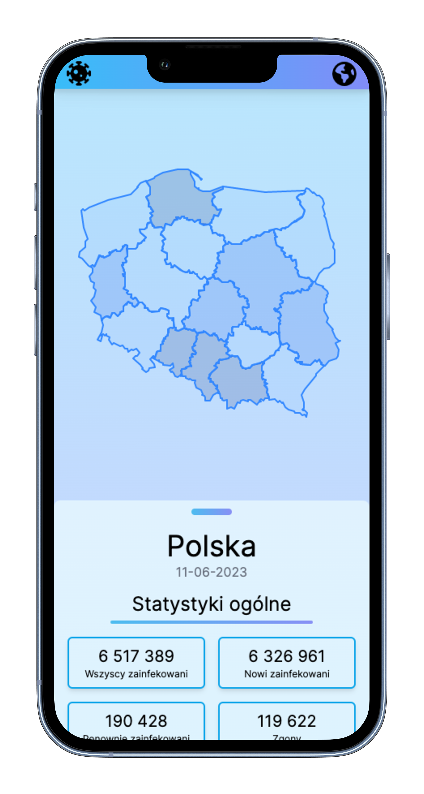

### COVISUAL

An app for COVID-19 data visualisation. Displays country details on main page, and also global stats avialable from sidebar.



## Getting Started

First, run the development server:

```bash
npm run dev
# or
yarn dev
```

For proper start of development process enviromental variables must be set up as per .env.example file:

```
MONGODB_URI=
VERCEL_URL="localhost:3000"
URL="localhost:3000"
GLOBAL_STATS_URL='https://covid-193.p.rapidapi.com'
RAPID_API_KEY=
RAPID_API_HOST='covid-193.p.rapidapi.com'
```

## Data

This aplication uses data from database for Polish statistics and fetches global stats with API call to extenral API ('https://covid-193.p.rapidapi.com').

Authorization keys requred.
